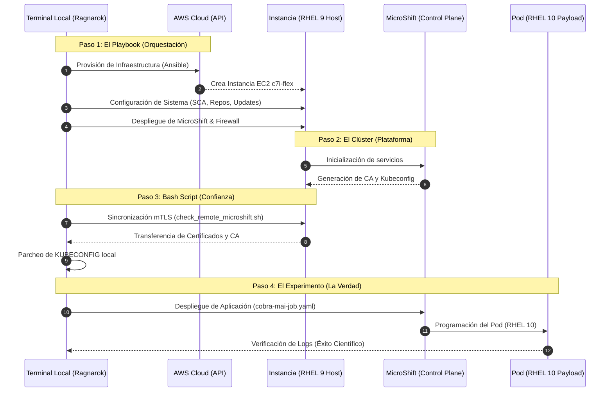

# 📖 Diario de una Orquestación: Paso a Paso en AWS

Este documento es una crónica técnica detallada del experimento **"Querida, encogí el clúster"**. A través de este recorrido, documentamos la verdad científica bajando desde la abstracción de la nube hasta el metal de **Red Hat Enterprise Linux (RHEL)**.

> *"La prueba de todo conocimiento es el experimento. El experimento es el único juez de la verdad científica"*. — **Richard Feynman**.

---

## Escena 1: Preparación del Entorno Local
Todo comienza en la terminal local, nuestro centro de mando. Antes de interactuar con la nube, debemos asegurar las herramientas de comunicación. En este laboratorio, trabajamos sobre una distribución Linux moderna (como **Fedora**).

* **Capacidad de Maniobra:** Instalamos el cliente oficial de AWS y las herramientas de gestión de OpenShift.
```
$ sudo dnf -y install awscli2
```
* **Configuración de Identidad:** Establecemos un perfil de AWS local con nuestras credenciales (Access Key y Secret Key) y definimos la región de operaciones (por ejemplo, **us-east-2** en Ohio).
```
$ aws configure --profile [TU_PERFIL_AWS]
```
* **Prueba de Vida (Verify)** Para confirmar que tu terminal local ya tiene _superpoderes_ sobre tu cuenta de AWS, ejecuta este comando:
```
$ aws sts get-caller-identity --profile [TU_PERFIL_AWS]
```
* **Crear el Security Group (El Firewall)** Antes de lanzar la "nave", necesitamos el escudo.
```
# Crear el grupo
$ aws ec2 create-security-group \
    --group-name microshift-sg \
    --description "Seguridad para MicroShift" \
    --profile [TU_PERFIL_AWS]

# Abrir puertos (SSH: 22, API K8s: 6443, HTTP: 80 HTTPS: 443)
$ aws ec2 authorize-security-group-ingress \
    --group-name microshift-sg \
    --protocol tcp --port [PUERTO] --cidr 0.0.0.0/0 --profile [TU_PERFIL_AWS]

```
* **Generar el Par de Llaves SSH (La llave de acceso al Edge)** Para conectarte a la instancia de **RHEL** que lanzaremos, necesitamos una llave `.pem` registrada en tu cuenta. Hazlo desde la CLI:
```
$ aws ec2 create-key-pair \
    --key-name [LLAVE_SSH] \
    --query 'KeyMaterial' \
    --output text > ~/.ssh/[LLAVE_SSH].pem --profile [TU_PERFIL_AWS]

$ chmod 400 ~/.ssh/[LLAVE_SSH].pem
```
* **Obtener el ID de la imagen (RHEL 9.5)** Ejecuta esto en tu sistema local para obtener la AMI más reciente de Red Hat.
```
$ aws ec2 describe-images \
    --owners 309956199498 \
    --filters "Name=name,Values=RHEL-9.5*x86_64*" "Name=state,Values=available" \
    --query 'sort_by(Images, &CreationDate)[-1].ImageId' \
    --output text \
    --profile [TU_PERFIL_AWS] \
    --region [TU_REGION]
```
* **Obtener la IP de la instancia** Antes de conectar, necesitamos saber a dónde apuntar. Puedes obtener la IP directamente desde tu terminal local con este comando:
```
$ aws ec2 describe-instances \
    --filters "Name=tag:Name,Values=RHEL-9.5*x86_64*" \
    --query 'Reservations[*].Instances[*].PublicIpAddress' \
    --output text \
    --profile [TU_PERFIL_AWS]
```
* **Crear Activation Key en el Portal de Red Hat** Al crear una instancia con la imagen de AWS (RHUI), el sistema está configurado para ver solo los espejos de Amazon. Aunque se registre la instancia, el sistema no tiene el _permiso_ (entitlement) para consultar el CDN de Red Hat directamente. Para evitar esta burocracia vamos a crear una llave de activación en el portal de Red Hat:
    * Ve a [Red Hat Hybrid Cloud Console](https://console.redhat.com/insights/connector/activation-keys). 
    * Crea una nueva llave: [TU_ACTIVATION_KEY].
    * En Workload, selecciona **Standard** y asegúrate de que _Simple Content Access_ (_SCA_) esté marcado como **Enabled**.
    * Copia tu **Organization ID** (un número de 7 u 8 dígitos).

---

## Escena 2: La Construcción Manual (Guía de Troubleshooting) 🛠️
Para entender la automatización, primero debemos comprender los engranajes. Si la orquestación falla, estos son los pasos para validar el sistema "al desnudo".

### 1. Lanzamiento de la Instancia
Provisionamos una instancia optimizada para cómputo (serie **c7i-flex.large**) utilizando una imagen verificada de **RHEL 9** (_ami-06a5d87db53294c1f_). Es vital asignar un grupo de seguridad que permita el tráfico para la API de Kubernetes, el Ingress y la gestión remota vía SSH.
```
$ aws ec2 run-instances \
    --image-id ami-06a5d87db53294c1f \
    --instance-type c7i-flex.large \
    --key-name [LLAVE_SSH] \
    --security-group-ids [ID_DE_TU_SECURITY_GROUP] \
    --tag-specifications 'ResourceType=instance,Tags=[{Key=Name,Value=MicroShift-Manual-Lab}]'
```

### 2. Inspección Rápida de la Instancia
Antes de meterle a MicroShift, vamos a ver qué hay bajo el capó de esta **c7i-flex.large**. Ejecuta estos tres comandos para "estrenar" el sistema:
```
# Verifica la versión de kernel incluida
$ uname -r

# Confirma que los 4GB están ahí para Microshift
$ free -h

# Revisa la versión de DNF 
$ dnf --version
```

### 3. Registro y Suscripción (SCA)
MicroShift requiere acceso a los repositorios oficiales de Red Hat. Configuramos el sistema para que gestione sus propios repositorios y lo registramos en el portal utilizando **Simple Content Access (SCA)** con nuestro ID de organización y una clave de activación.
```
# Habilitar gestión de repos en configuración de nube
$ sudo sed -i 's/manage_repos = 0/manage_repos = 1/' /etc/rhsm/rhsm.conf

# Registro con tus credenciales de Red Hat Portal
$ sudo subscription-manager register --org="[TU_ORG_ID]" --activationkey="[TU_ACTIVATION_KEY]"
```

### 4. Preparación del Sistema y Kernel
Habilitamos los canales específicos para **MicroShift 4.21** y **Fast Datapath**. Realizamos una actualización completa del sistema para garantizar que el kernel y las librerías base estén en su versión más estable antes de recibir la plataforma. Tras esto, un reinicio es obligatorio para aplicar los cambios de bajo nivel.
```
$ sudo subscription-manager repos \
    --enable="rhocp-4.21-for-rhel-9-x86_64-rpms" \
    --enable="fast-datapath-for-rhel-9-x86_64-rpms"

$ sudo dnf -y update
$ sudo reboot
```

### 5. Instalación de Componentes y Red
Instalamos el binario de MicroShift, los clientes de OpenShift y el servicio de Firewall. La orquestación de red es crítica aquí: **desactivamos y enmascaramos** servicios de red legados (iptables/nftables) para que **firewalld** tome el control total. Abrimos los puertos críticos para la comunicación del clúster (6443, 80, 443, 10250 y los puertos de etcd).
```
$ sudo dnf -y install microshift openshift-clients firewalld

# Orquestación de servicios de red: No Mercy para iptables
$ sudo systemctl mask iptables ip6tables nftables
$ sudo systemctl enable --now firewalld

# Apertura de puertos: API (6443), Ingress (80, 443), SSH (22), Kubelet (10250)
$ sudo firewall-cmd --permanent --add-port={22,6443,80,443,10250,2379-2380}/tcp
$ sudo firewall-cmd --reload
```

### 6. Configuración de Identidad del Clúster
MicroShift está instalado, pero para que pueda descargar las imágenes de los contenedores (etcd, api-server, etc.) de registry.redhat.io, necesita tus credenciales.
* Ve a [console.redhat.com/openshift/install/pull-secret]()
* Copia el JSON del **Download pull secret**.
* Crea el archivo en tu instancia de AWS.
```
# Crea el directorio si no existe
$ sudo mkdir -p /etc/crio

# Pega tu secreto aquí (asegúrate de que sea un JSON válido)
$ sudo vim /etc/crio/openshift-pull-secret
$ sudo chmod 600 /etc/crio/openshift-pull-secret
```
Finalmente, configuramos el archivo de parámetros de MicroShift para incluir la IP pública de AWS en los **Subject Alternative Names (SAN)** del certificado TLS. Esto permite que nuestra terminal local confíe en el servidor remoto.
```
$ sudo tee /etc/microshift/config.yaml <<EOF
apiServer:
  subjectAltNames:
    - [TU_IP_PUBLICA_AWS]
EOF

$ sudo systemctl enable --now microshift
```

   * **Tip de Pro**: Puedes seguir el arranque en tiempo real para ver cómo descarga las imágenes y levanta los componentes:
   ```
   $ sudo journalctl -u microshift -f
   ```

### 7. Configurar el acceso (`oc` / `kubectl`)
MicroShift es generoso y te deja el archivo de configuración listo para usarse. Ejecuta esto para que tu comando `oc` sepa a dónde mirar:
```
# Crea el directorio .kube en el home del usuario ec2-user
$ mkdir -p ~/.kube
$ cp /var/lib/microshift/resources/kubeadmin/kubeconfig ~/.kube/config
$ chmod 600 ~/.kube/config

# Verifica el estado de los nodos
$ oc get nodes

# Verifica que los pods del sistema estén levantando
$ oc get pods -A
```

### 8. Automatización Inicial
Para validar la salud del nodo creado en la instancia, utiliza el _bash-script_ de verificación desde tu terminal local (te pedirá ingresar la IP de tu instancia, ten este dato a la mano):
* `check_remote_microshift.sh`
```
$ ./check_remote_microshift.sh
##########################################################
#   Control de Mando MicroShift                          #
##########################################################

== Paso 1: Preparando entorno local ==
[OK] Respaldo creado en: $HOME/.kube/.kube_backup_[FECHA]_[HORA]
Introduce la IP pública de la instancia de AWS: [IP_DE_TU_INSTANCIA]

== Paso 2: Validando salud del nodo remoto ==
[OK] Conectividad establecida (RHEL 9.7)
[OK] MicroShift está ACTIVO

== Paso 3: Configurando acceso mTLS local ==
config                        100% 5690    32.6KB/s   00:00    

[OK] Acceso mTLS configurado y listo.

Para interactuar con el cluster, ejecuta:
export KUBECONFIG=$HOME/.kube/config-aws-microshift
oc get nodes

== Verificación finalizada con éxito ==
$
``` 

Para finalizar, verifica la comunicación con el clúster.
```
$ export KUBECONFIG=$HOME/.kube/config-aws-microshift
$ oc get nodes
NAME                                                    STATUS   ROLES                         AGE     VERSION
ip-[IP-DE-TU_INSTANCIA]].[TU_REGION].compute.internal   Ready    control-plane,master,worker   2m19s   v1.34.2
```
> [**NOTA**]
> El clúster tarda un par de minutos para estar en status **Ready**. Si te aparece como **NotReady**, solamente dale unos minutos y vuelve a verificar.
---
## Escena 3: La Gran Orquestación (Ansible)
Una vez comprendido el proceso manual, delegamos la repetición a la máquina. El Playbook maestro condensa todos los pasos de la escena anterior en una ejecución **idempotente**. La automatización no solo nos da velocidad; nos da la garantía de que el proceso está vivo en memoria y no solo escrito en el disco duro.
```
$ ansible-playbook full_microshift_automated.yml
```
> [**NOTA**]
> El playbook condensa toda la **Escena 2** en una ejecución idempotente que toma aproximadamente **10 minutos**. Puedes verificarlo anteponiendo el comando `time` antes de la ejecución del playbook:
```$ time ansible-playbook full_microshift_automated.yml```
---

## Escena 4: Sincronización mTLS (El Plan A)
Para que nuestra terminal local hable con el API Server remoto sin errores de confianza, ejecutamos un proceso de sincronización. Este paso extrae la Autoridad Certificadora (CA) generada dinámicamente en el host de AWS y parchea nuestra configuración local, permitiendo una comunicación cifrada y segura de extremo a extremo.

Ejecuta el script `check_remote_microshift.sh` para este fin:

```
$ ./check_remote_microshift.sh
[OK] Conectividad establecida (RHEL 9.7)
[OK] MicroShift está ACTIVO
[OK] Acceso mTLS configurado y listo.
```
---

## Escena 5: El Experimento de Feynman (Éxito Final) ⚛️
Fieles a la filosofía de que _el experimento es el único juez_, validamos la verdadera potencia del EDGE ejecutando una carga de trabajo de próxima generación (**RHEL 10**) sobre un host estable (**RHEL 9**).

**Paso 1** Lanzar el job:
```
$ oc apply -f cobra-mai-job.yaml
job.batch/edge-training-job created
```

**Paso 2** Verificar la Verdad Científica:
```
$ oc logs job/edge-training-job

>> [STEP 1] Strike First: Validando Kernel del Host (RHEL 9)...
Linux 5.14.0-611.38.1.el9_7.x86_64
>> [STEP 2] Strike Hard: Auditando Sistema del Pod (RHEL 10)...
Red Hat Enterprise Linux release 10.1 (Coughlan)
>> [STEP 3] No Mercy: Verificando coexistencia de capas...
Análisis completado: Payload RHEL 10 operando sobre Metal RHEL 9.
```

Utilizamos un **Kubernetes Job** para procesar una tarea autónoma. Los resultados demostraron que:
1. El contenedor hereda la robustez del kernel del host.
2. La inmutabilidad nos permite saltar generaciones de software sin fricción.
3. El payload de **RHEL 10.1 (Coughlan)** operó con éxito total sobre el metal de **RHEL 9**.
---

## 🗺️ Mapa del Experimento: Del Código al Futuro

Para entender cómo se construye la "verdad científica" en este laboratorio, es necesario visualizar la interacción entre nuestra terminal local, la nube de AWS y las capas de software. El siguiente diagrama describe el flujo de orquestación completo:


**Desglose del Flujo**:
1. **La Orquestación (Playbook)**: Ansible actúa como el director de orquesta, asegurando que la infraestructura en AWS y la configuración de RHEL 9 sean idénticas en cada ejecución.

2. **La Confianza (Bash-Script)**: Debido a que MicroShift genera certificados dinámicos, el script de Bash automatiza el "apretón de manos" de seguridad (mTLS), permitiendo que tu terminal local maneje el clúster remoto de forma transparente.

3. **La Verdad Científica (K8s Job)**: El Job de Kubernetes no es solo una aplicación; es nuestra sonda de prueba. Al ejecutar RHEL 10 dentro de un host RHEL 9, confirmamos que la abstracción de MicroShift funciona y que el experimento ha validado nuestra hipótesis de interoperabilidad generacional.

---
## Epílogo
La orquestación inteligente de MicroShift nos permite transformar hardware limitado en nodos de innovación constante. El EDGE no es solo hardware pequeño; es la frontera donde la estabilidad y el futuro coexisten.

**Experimento concluido con éxito.**

---

## Escena Post-Creditos: El Agujero del Conejo (Solución en progreso) 🕳️
Durante el laboratorio, , no todo fue automatización perfecta. Nos enfrentamos a un desafío real con el **Router de MicroShift**, donde la abstracción de Kubernetes chocó frontalmente con la realidad del metal en AWS.  

A pesar de que el Pod de la aplicación estaba saludable y el Service respondía correctamente a las peticiones internas, el puerto físico 80 del host de RHEL se negaba a escuchar.

* **Anatomía del fallo:** La conectividad interna (Pod-to-Pod y Service IP) fue exitosa, pero el proceso del Router no logró realizar el *bind* al puerto físico.
* **Estado:** Esta investigación sigue abierta. Se sospecha de una restricción de privilegios en el modo **HostNetwork** o una colisión de políticas de seguridad al inicio del servicio. Se documentará el hallazgo final en una actualización futura de este diario.

Si quieres ver la autopsia técnica, las pruebas de "bisturí" con pods de diagnóstico y el estado actual de la investigación, consulta el diario especializado:

👉 **[Diario de Troubleshooting: El Misterio del Puerto 80](./AWS_TROUBLESHOOTING_ROUTER.md)**

---
👤 **Alex (@rootzilopochtli)** *Content Architect en Red Hat | Autor de "Fedora Linux System Administration"*
