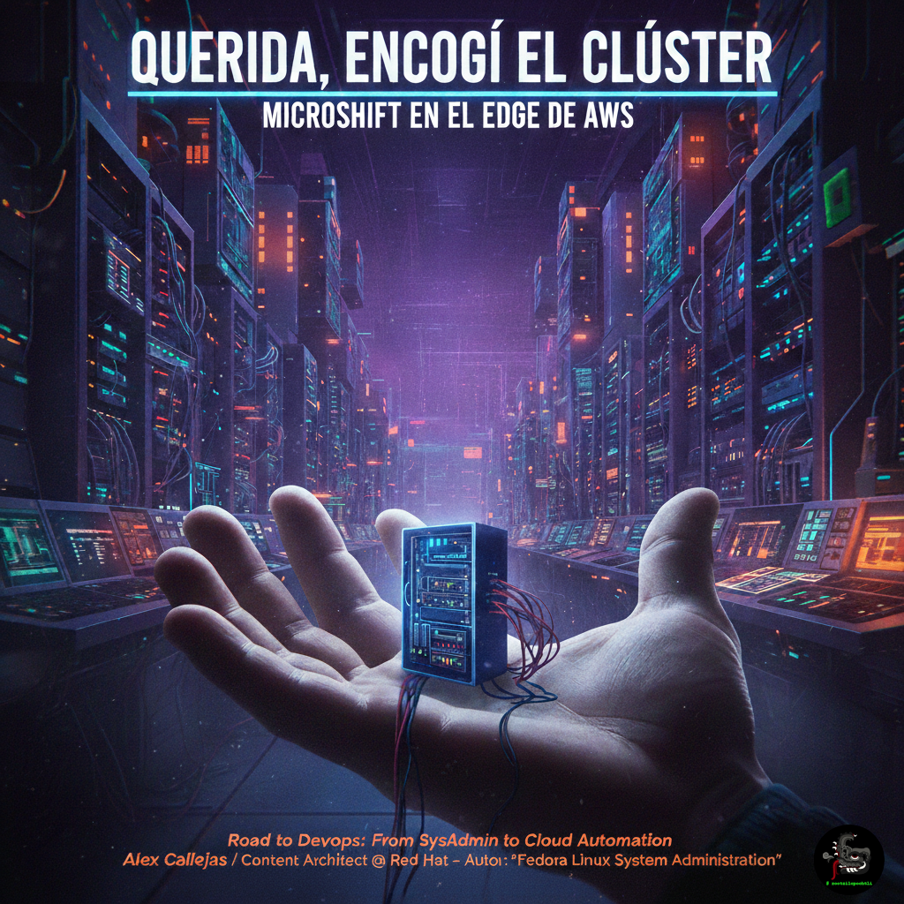

# 🤏☸️ Querida, encogí el clúster (Honey, I shrunk the cluster)

> *"Geek by nature, Linux by choice, Fedora of course..."*

Este repositorio proporciona una infraestructura completa como código (IaC) para desplegar **MicroShift** tanto en entornos de nube pública como en **Cloud Local**. A diferencia de los servicios gestionados tradicionales, este proyecto se enfoca en la **soberanía del sistema operativo**, utilizando **Ansible** para orquestar nodos compactos de **Fedora Linux** y **Red Hat Enterprise Linux (RHEL)**.

Incluye experimentos de "Future-Proofing" que demuestran la ejecución de cargas de trabajo de próxima generación, validando que en el EDGE y en el laboratorio personal, el experimento es el único juez de la verdad.

## ⚛️ Filosofía: El Factor Feynman
Como decía el **Dr. Richard Feynman**:
*"El principio de la ciencia, casi la definición, es el siguiente: «La prueba de todo conocimiento es el experimento». El experimento es el único juez de la verdad científica"*.

Aquí no consumimos nubes; las desarmamos para entender cómo funcionan.

## ☁️ Laboratorios Disponibles

| Plataforma | Estado | Descripción |
| :--- | :--- | :--- |
| [**Fedora Edge / Local**](./fedora-edge) | 🚀 **Nuevo** | MicroShift sobre Fedora. El "Cloud Local" para la administración diaria. |
| [**AWS (Amazon Web Services)**](./AWS) | ✅ Activo | MicroShift sobre RHEL 9 en EC2. |
| [**GCP (Google Cloud Platform)**](./GCP) | 🚧 WIP | Próximamente para el Google Dev Fest. |

## 🥑 El Corazón en la Comunidad: Fedora México
La sección [**/fedora-edge**](./fedora-edge) es el punto de encuentro entre la potencia de Kubernetes y la agilidad de la comunidad. Este segmento del proyecto está diseñado específicamente para:

* **Impulsar el uso de MicroShift** dentro del Proyecto Fedora.
* **Servir como base técnica** para workshops, demos y charlas en eventos de la comunidad.
* **Facilitar la transición** de contenedores individuales (Podman) a la orquestación real (Kubernetes) usando la CLI `oc` de forma 100% práctica.

## 🤝 Contribuciones y Uso
Este es un proyecto de uso general. Siéntete libre de:
1. **Hacer un Fork** del proyecto.
2. **Adaptar los archivos** con tu información local (llaves SSH, perfiles de nube, IDs de suscripción).
3. **Enviar un PR** si encuentras una solución a la **[Escena Post-Créditos de AWS](./AWS/AWS_TROUBLESHOOTING_ROUTER.md)** o si quieres añadir soporte para una nueva nube.

---
👤 **Alex (@rootzilopochtli)** *Content Architect en Red Hat | Miembro de Fedora Project | Autor de "Fedora Linux System Administration"*
